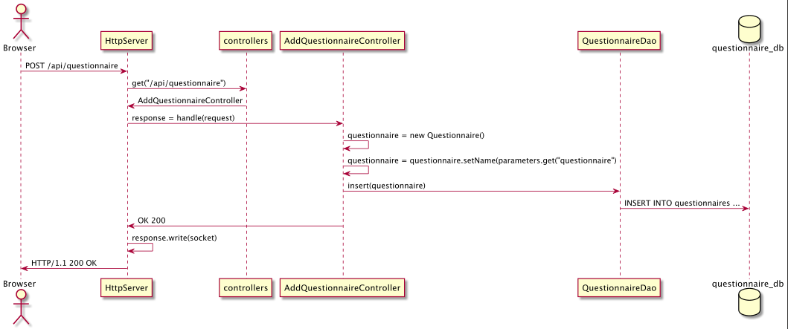
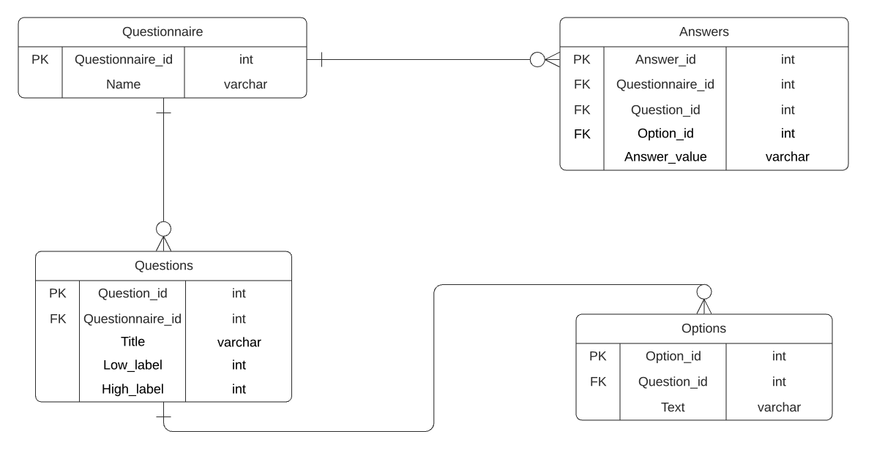
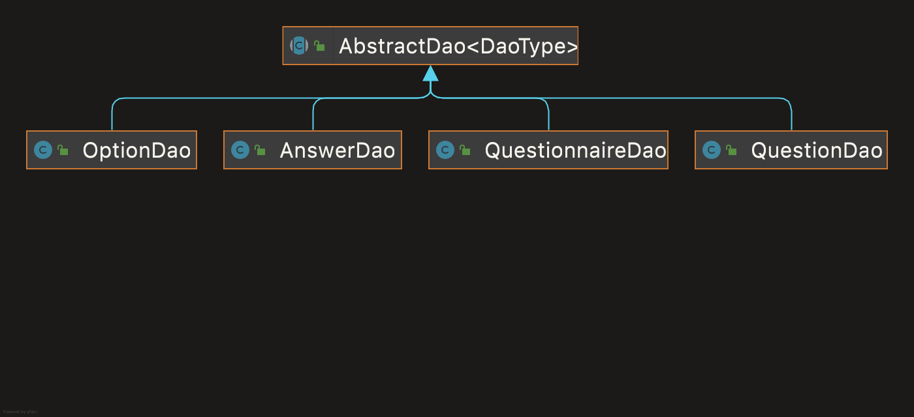

Eksamen i PGR203 - Avansert Java. Denne eksamenen ble sensurert til karakteren A. 

Orginalt repository https://github.com/kristiania-pgr203-2021/pgr203-exam-OrjanSkotnes

# PGR203 - Exam - Questionnaires

## How to run this program
### Follow these steps to build an executable jar-file
* Open the program folder in IntelliJ
* Run `mvn package` in terminal. This command builds the jar-file.
* Make sure to make a `pgr203.properties` file, this file must be inside the root folder where the jar-file is stored.
* `pgr203.properties` must contain the following:
  * dataSource.url = jdbc:postgresql://localhost:5432/ <- name of your database
  * dataSource.user = the username to the owner of your database
  * dataSource.password = the password to the user. 

* To run the jar-file: `java -Dfile.encoding="UTF-8" -jar target/pgr203-exam-OrjanSkotnes-1.0-SNAPSHOT.jar`
* Server will start at: http://localhost:8080/index.html

#### Your database will be inserted with dummy data, so you can test all the functionality in the app right away.

## Our work progress
During this assignment we have worked mostly physical at school. We built our applications using the pair-programming principals (test driven development).
We have worked with another during the mandatory assignments this semester, so we have a very good working relationship.

Before we started working on the project, we made our UML database diagram and implemented it into an actual database. Tested it with all references and with query's. Just to make sure the database worked as intended.
Because of this we had little issues with the database build, and the migration files was easy to implement.
We used GitHub as version control, both are familiar with GitHub, and we had no problem with commits or pull requests during this assignment.

The server build process was built in a few days, this was quite familiar after all the assignments. After the server was built it was about time to test our database.
In memory testing with h2.database worked out great. Creating the data-access-objects with the abstract dao-class was kinda new to us. But it worked out as intended, and removed duplicated code.
After testing all the dao-classes with h2. We made controllers to handle all request to our database, so our server-code got more compact and stable and now outsources all request to controllers. 
This worked out as planned.

When the controllers were implemented, we could start working on the extra functionality on our application. 

We tried to set up Coveralls to report our test coverage, it did not work. Mainly because of the number of subscribers to the GitHub classroom had exceeded. 
You also had to pay for the pro version to get access to the github-classroom repo. 

All inn all, we really enjoyed this project. We had a few bumps and errors on the road. But we are proud of our solution to this exam.

### Things we learned in this project
* The value of pair-programming.
* Take a good pause during the difficult tasks and errors.
* Good structure and planning from the start makes the assignment easier to comprehend.

## HttpServer design 

Our HttpServer is designed with controllers witch is controlling the DAO's. We have implemented controllers for every action where we access data from the database. In the diagram above you'll see how the server works when you add a new questionnaire to the database. 

## Database design

We used four tables in our project. All questions refer to a questionnaire, and all options refers to questions.
The answer table contains all metadata with the answer value (1-5).

We implemented DELETE CASCADE. Then the user could delete a questionnaire and all the related questions and options would also be deleted.
The same goes to if you delete a question, it will delete the referring options tied to the question.

## DAO design

We started creating DAO's to each entity, and realized early they all have the same methods, more or less. So we implemented the AbstractDao class.
Every dao extends the AbstractDao, so all the CRUD methods are inherited. This makes the dao methods less redundant, and it worked out great for us.

## Extra functionality 
* The application lets you add multiple questionnaires.
  * A set of questions can be tied to one questionnaire, and a set of options can be set to a single question.
  * Scaling on every option.
  * Add questions, add options.
  * Edit every entity.
  * Delete cascade on questionnaire. All tied questions and options will also ble deleted. NB: this is optional. You can also delete a single question and all options tied to it will be deleted.
  * List out a summary of answers tied to a questionnaire.
* Test: good line coverage at 89%.
* Fixed if user goes to "/" root issue.
* Used abstract dao-class to avoid duplicated crud-code.
* Fixed the content-type issue we had in class with CSS.
* Fixed encoding. All characters work.
* The user gets redirected after a POST.
* Diagrams for HttpServer, DAO classes and database are made.
* Server reads favicon.
* Good use of DAO-pattern and controllers to handle them.

## Evaluation of us
Of course the whole solution, but also our TDD approach with pair-programming from the very start. 
Our project structure, test and commits.
The extra functionality put into this project, and all the hard work we've done through these tree weeks.

